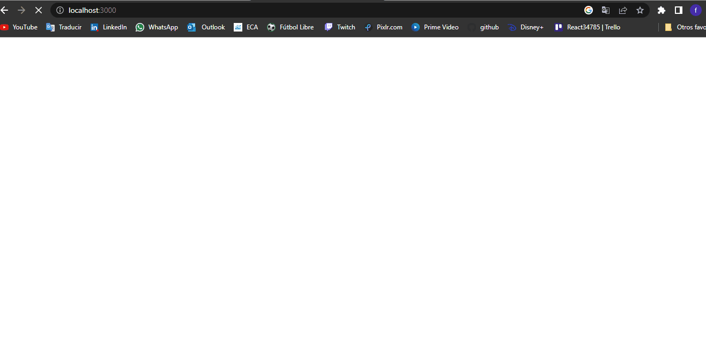

# Mapple ecommerce
#### Mapple es mi proyecto final del curso de react.js de Coderhouse.

## GIF

[

Mapple es mi primer proyecto realizado en React.js y en el utilize:

- React.js
- Firebase
- react-router-dom
- Context
- Uiball/loaders
- Sweet alert
- Font awesome
- JSX
- CSS

## Installation

In the project directory, you can run:

### `npm start`

Runs the app in the development mode.\
Open [http://localhost:3000](http://localhost:3000) to view it in your browser.

The page will reload when you make changes.\
You may also see any lint errors in the console.